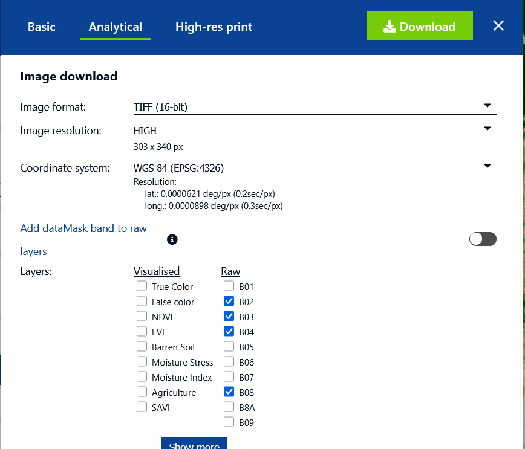
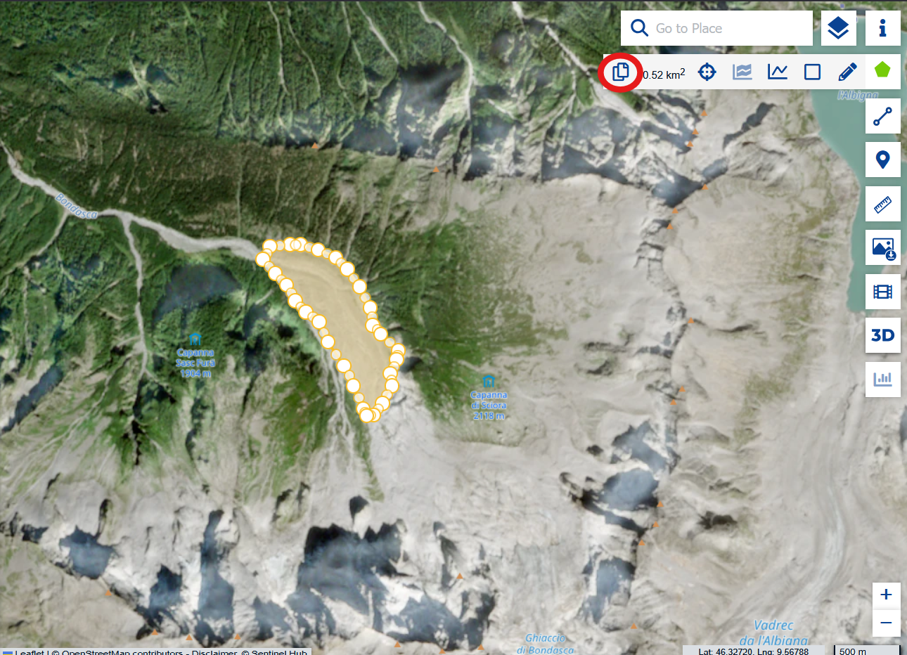
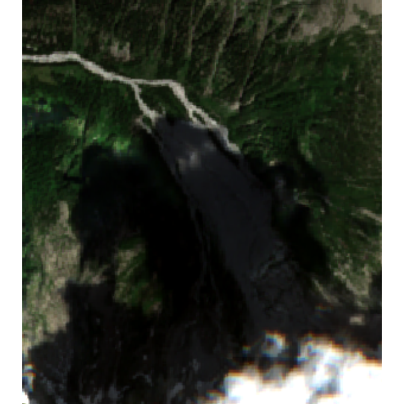
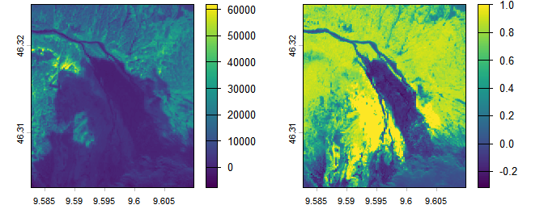
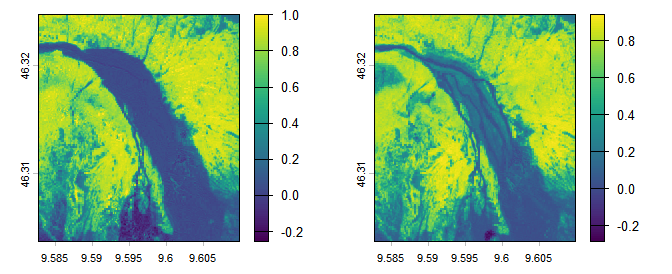
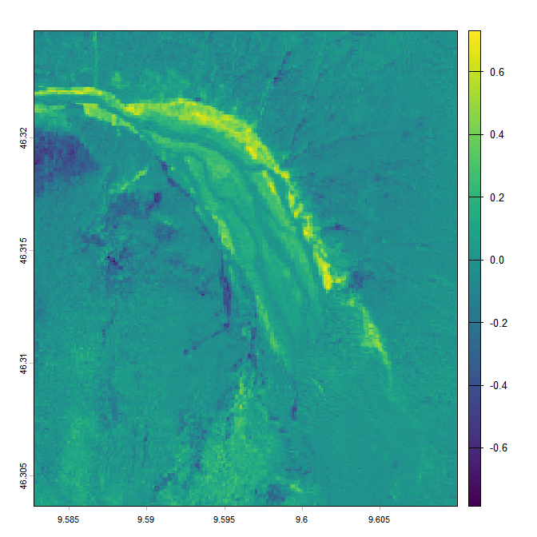
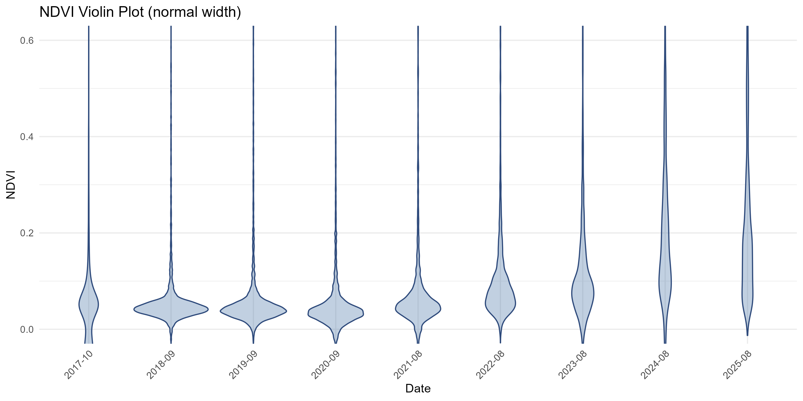
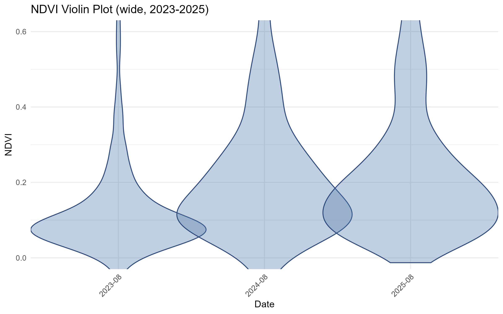
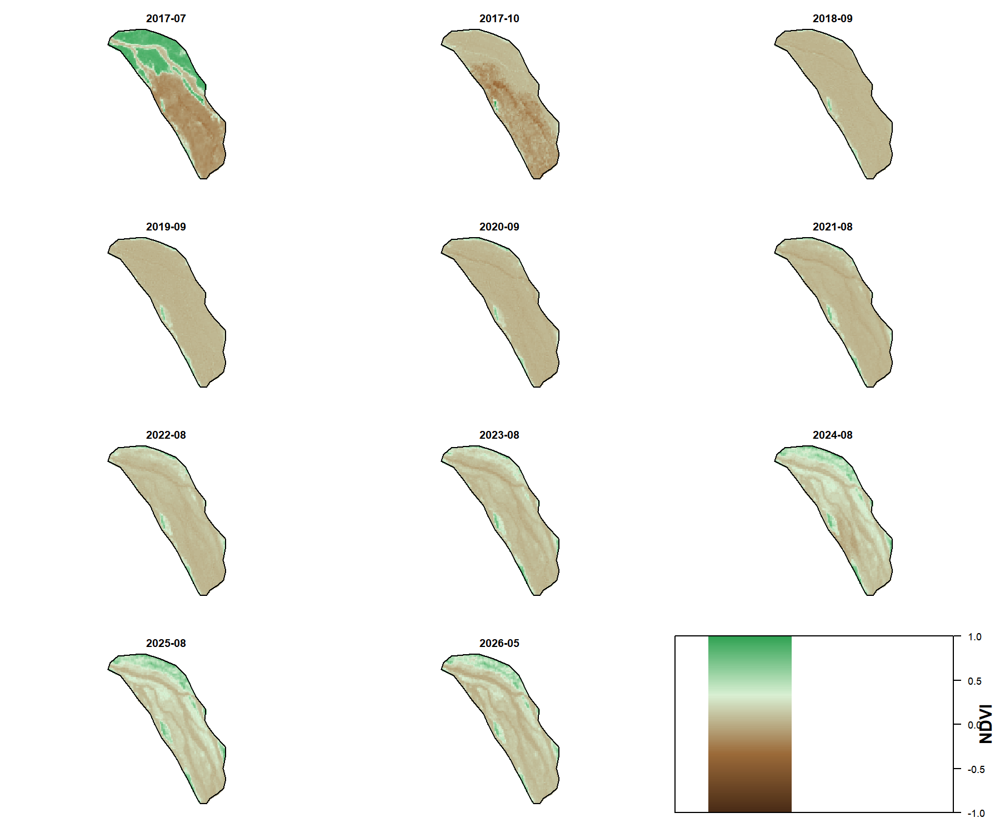
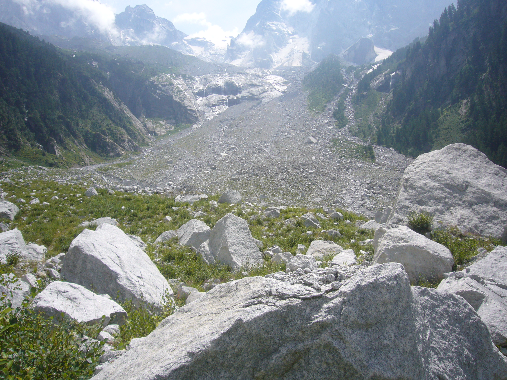

# Analyzing the development of vegetation on a rockfall debris body

## Idea and Goal

After a major rockfall, the slope is usually covered by a deposit of rockfall debris. Over time, however, vegetation can recolonize these debris bodies. The aim of this project is to get an idea of how much vegetation covers the debris and how this changes over time.

The Bondo rockfall near Piz Cengalo in Switzerland is a great example. It happened in August 2017. As Sentinel-2 L2A data is available since March 2017, it's a great opportunity to use this data.

For the analysis I compare NDVI images from the summers between 2018 and 2025.
Also, I want to provide a reproducible way to do this for other locations.

## Packages

For the import and processing, some packages were crucial:

- `terra` for the import tools `rast()` and `vect()`
- `imageRy` for the plot functions like `im.plotRGB()` and the dvi/ndvi functions `im.dvi()` and `im.ndvi()`

The packages were downloaded and loaded like this:

```r
install.packages("terra")
library(terra)
install_github("ducciorocchini/imageRy")
library(imageRy)
```

## Data import

### Download of the raw satellite raster data

The raw data was downloaded from the [Copernicus Data Browser](https://browser.dataspace.copernicus.eu). Besides visualizing the scene, the platform also allows downloading Sentinel-2 data for specific days and regions of interest (ROIs) as GeoTIFF files, which makes them suitable for further processing.



For each year, one day in August or September was chosen in order to compare yearly effects and not the plant physiology within different seasons. The selected days have less than 15% cloud cover and, if possible, no clouds inside the ROI. For each date, the four bands B02 (blue), B03 (green), B04 (red), and B08 (NIR) were downloaded. More information about the bands can be found at the [Sentinel documentation](https://docs.sentinel-hub.com/api/latest/data/sentinel-2-l2a/#available-bands-and-data).

The downloaded data is organized in the following structure:

```markdown
WD/
├── YYYY-MM1/          # e.g. 2017-07
│   ├── B02.tiff
│   ├── B03.tiff
│   ├── B04.tiff
│   ├── B08.tiff
│
├── YYYY-MM2/          # e.g. 2026-05
│   ├── B02.tiff
│   ├── B03.tiff
│   ├── B04.tiff
│   ├── B08.tiff
│...
```

### Import of the TIFF files into R

The script [import_raw_tiffs.R](Code/import_raw_tiffs.R) loads the TIFF files into R with the package `terra` and assigns them names based on date and band. It also creates multi-layer raster objects from the individual band files.

```r
library(terra)

setwd("C:/Users/jakob/Uni/Erasmus/Telerilevamento/Esame/Raw Data")
dirs <- list.dirs(".", recursive = FALSE, full.names = TRUE)

for (dir in dirs) {
  dir_files <- list.files(dir, recursive = FALSE, full.names = TRUE, pattern = "\\.tiff$", ignore.case = TRUE)
  for (file in dir_files) {
    folder_name <- gsub("-", "", basename(dir))
    band_name <- tools::file_path_sans_ext(basename(file))
    var_name <- paste0("t", folder_name, "_", band_name)
    assign(var_name, rast(file), envir = .GlobalEnv)
  }
  var_name2 <- paste0("t", folder_name)
  assign(var_name2, c(get(paste0("t", folder_name, "_B04")), get(paste0("t", folder_name, "_B03")), get(paste0("t", folder_name, "_B02")), get(paste0("t", folder_name, "_B08"))), envir = .GlobalEnv)
}
```

The naming convention is `tYYYYMM` for the multi-layer raster objects and `tYYYYMM_B0X` for the single-band raster objects. For example, `t202605` is the multi-layer raster object for May 2026, and `t202605_B02` is the blue band for that date.

### Import of the Region of Interest (ROI)

The raster can cropped to a Region of Interest (ROI). In this project, the ROI is the debris body. The ROI was imported from a `.geojson` file. This is convenient because GeoJSON files can be created directly in the Copernicus Data Browser.



The following script imports `roi.geojson` and saves it as an RDS object.

```r
library(terra)
setwd("C:/Users/jakob/Uni/Erasmus/Telerilevamento/Esame/WD")
if (!file.exists("roi.geojson")) stop("roi.geojson not found")

roi <- vect("roi.geojson")
saveRDS(roi, "roi.rds")
assign("roi", roi, envir = .GlobalEnv)
message("ROI loaded and saved in roi.rds")

setwd("C:/Users/jakob/Uni/Erasmus/Telerilevamento/Esame")
```

## Data processing

### First visualizations

#### Visualization of the data as a natural color image

To view the satellite image, the red, green, and blue bands of one date have to be stacked. This is already done in the multi-layer raster object, and the function `im.plotRGB.auto()` from the package `imageRy` visualizes it as a natural color image.

```r
library(imageRy)

im.plotRGB.auto(t201707)
```

The result is a natural color image, here the one from July 2017.



Some clouds are visible in the bottom right corner. The center of the image is quite dark because of the mountain shadow.

#### Visualization of the data as a false color image

A false color image can also be created. Usually the blue band is not used in false color compositions. Instead, the green band is shown in blue, the red band is shown in green, and the NIR band is shown in red.

With `im.plotRGB()`, the used bands can be specified manually. Here the fourth layer (NIR) of the multi-layer raster object is used for red, and so on.

```r
im.plotRGB(t201707, r = 4, g = 3, b = 2)
```


In this view, the shadow is still clearly visible because the reflected light is very low. The clouds also stand out, as they reflect almost all wavelengths. The red areas represent vegetation, because healthy plants reflect NIR very strongly.

#### Visualization of the data as NDVI images

Another useful visualization is the DVI and NDVI.

The DVI, or Difference Vegetation Index, is calculated for each pixel by subtracting the red band value from the NIR band value:

$$
\mathrm{DVI} = \mathrm{NIR} - \mathrm{R}
$$

The NDVI, or Normalized Difference Vegetation Index, is the normalized version:

$$
\mathrm{NDVI} = \frac{\mathrm{NIR} - \mathrm{R}}{\mathrm{NIR} + \mathrm{R}}
$$

A high NDVI means that much more NIR than red light is reflected. Healthy vegetation strongly reflects NIR and absorbs red light, so it produces high NDVI values.

Both indices can be created with `im.dvi()` and `im.ndvi()` from `imageRy`. The functions only return raster objects, so they have to be plotted manually.

```r
par(mfrow = c(1, 2))
plot(im.dvi(t201707, nir = 4, red = 3))
plot(im.ndvi(t201707, nir = 4, red = 3))
```



The difference is clearly visible. First, the scale and the units are different. The DVI has a larger numeric range and is directly related to reflected intensity. In shaded areas, the DVI values are also low.

The NDVI values are normalized and usually range from 0 to 1 without a unit. Because of that, shadow effects are reduced much more strongly. This makes the NDVI better suited for comparing vegetation cover across different areas and dates.

NDVI values from 0 to 0.2 usually indicate barren soil, whereas water, snow, and clouds often have negative values. Vegetation typically ranges from about 0.3 to 0.8, with healthier vegetation reaching higher values.

In the image, an elongated area with low NDVI can be seen in the center. This area contains mostly rockfall debris without vegetation. The surrounding areas show much higher NDVI values, which indicates dense forest cover.

### Multitemporal analysis

#### Qualitative Analysis

To compare the situation over time, the NDVI maps from two different years (here: 2018 and 2025) can be calculated and plotted side by side.

```r
ndvi201809 <- im.ndvi(t201809, nir = 4, red = 3)
ndvi202508 <- im.ndvi(t202508, nir = 4, red = 3)
par(mfrow = c(1, 2))
plot(ndvi201809)
plot(ndvi202508)
```



The change becomes even more visible in a difference map. The NDVI difference is calculated by subtracting the 2018 map from the 2025 map:

$$
\delta \mathrm{NDVI} = \mathrm{NDVI}_{2025} - \mathrm{NDVI}_{2018}
$$

I used a red-white-green palette, where red represents negative values, white indicates values around zero, and green represents positive values.

```r
cols <- colorRampPalette(c("red", "white", "forestgreen"))(100)
d_ndvi20252018 <- ndvi202508 - ndvi201809
plot(d_ndvi20252018, col = cols)
```



The difference map shows that the NDVI increased in parts of the debris body. The increase seems to be especially strong along the rim of the debris area. The river network can also be recognized clearly.

On the steeper parts of the slopes, NDVI decreased in some places, which may be related to erosional processes.

#### Quantitative Analysis

To quantify the NDVI differences between the years, the raster is cropped to a Region of Interest (ROI). The package `terra` provides `crop()` and `mask()` for this purpose. `crop()` reduces the raster to the rectangular extent of the ROI, and `mask()` sets all pixels outside the ROI to `NA`.

After importing, `roi` can be used to crop and mask the NDVI raster. The values of the cropped image can then be stored in a new object `v_ndviYYYYMM`.

```r
roi_ndvi201809 <- mask(crop(ndvi201809, roi), roi)
v_ndvi201809 <- values(roi_ndvi201809, na.rm = TRUE)
summary(v_ndvi201809)
sd(v_ndvi201809)
```

The resulting statistics can then be used for a quantitative comparison between the years.

```markdown
 B08          
 Min.   :-0.03850  
 1st Qu.: 0.03441  
 Median : 0.04472  
 Mean   : 0.06462  
 3rd Qu.: 0.05776  
 Max.   : 0.78564  

 SD     : 0.08467
```

The more advanced script [ndvi_crop.R](Code/ndvi_crop.R) applies the same crop-and-mask workflow to all dates and combines the values in a dataframe. The rows correspond to pixel positions inside the cropped image, while the columns represent the different dates. This makes it possible to calculate and visualize distribution statistics across time.

By plotting the NDVI values of the cropped rasters by year as boxplots or violinplots, some interpretations can be made.



It is clearly visible, that the NDVI values in the ROI increase over the years. This means that the vegetation is growing again. Looking at the violin plots, it can be observed that the value distribution is monovariant in the first years and then becomes bivariant in the last three years.



To find out, why that's the case, it's important to look at the spatial distribution of the values over the years again:



Here it becomes visible, that in some parts the NDVI is increasing, while in some other parts it stays quite low. These areas are located along the main river channels, where erosion and resedimentation by the water is a lot more active than in the other parts. In these areas its very difficult for plants to grow.
In addition to that, it becomes visible, that the NDVI is highest in the outer ("rim") part of the debris body. This is probably the case because the surrounding vegetation is very close, and because the debris body should be thin there. So probably some plants are growing through the debris, and some pioneer plants are likely migrating inward from the rim. 

In August 2023, a photo was taken, that shows the vegetation quite well:

(Published by Anidaat on [Wikimedia commons](https://commons.wikimedia.org/wiki/File:Val_Bondasca_06.jpg), licensed under [CC BY-SA 4.0](https://creativecommons.org/licenses/by-sa/4.0))

## Functions of the package rockfallveg

The scripts above form the basis of the workflow and are the easiest way to explain the project logic. Later, the same steps were bundled into package functions in the [Package](Package/) folder to make the workflow reusable and more structured.

These functions are a more technical layer of the project, so I would treat them as implementation details rather than the main narrative. In particular, they mirror the same tasks as the simple scripts: importing raw TIFF files, importing the ROI, calculating NDVI values, cropping the rasters, and creating plots.

This way, the project remains easy to follow while still showing that the workflow was later formalized into reusable functions.
